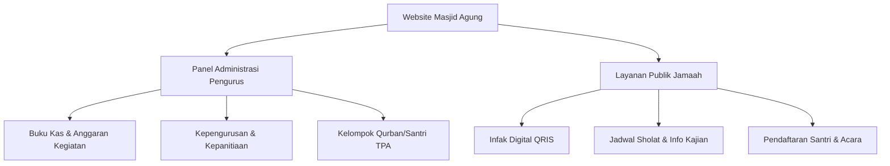

# Proposal Digitalisasi Manajemen Masjid Agung Nujumul Ittihad Sinjai
**Tanggal:** 2026-06-20  
**Versi Dokumen:** v1.0.0  
**Status:** Draf  
**Penyusun:** Alexa (AI Assistant)  

---

## SLIDE 1: JUDUL & PENGANTAR
### **Menuju Masjid Modern Berbasis Transparansi dan Pelayanan Digital**
*Proposal Digitalisasi Manajemen Operasional dan Pelayanan Jemaah*

**Masjid Agung Nujumul Ittihad Kabupaten Sinjai**  
*Mewujudkan Tata Kelola Masjid yang Transparan, Akuntabel, dan Dekat di Hati Jemaah.*

---

## SLIDE 2: LATAR BELAKANG & MASALAH UTAMA
### **Tantangan Pengelolaan Masjid Tradisional**
1. **Transparansi Keuangan Terbatas**: Jemaah hanya mengetahui total kas lewat papan tulis jumat, tanpa rincian kas masuk/keluar harian.
2. **Koordinasi Kepanitiaan Manual**: Susunan panitia Ramadhan, Idul Adha, dan PHBI sering kali tumpang tindih dan sulit berkoordinasi secara terpusat.
3. **Pencatatan Kelompok Kerja Lambat**: Pembagian kelompok qurban, petugas buka puasa, dan pendaftaran santri TPA masih berbasis kertas (risiko hilang/rusak tinggi).
4. **Minimnya Dokumentasi Publik**: Berita kegiatan dakwah, kajian rutin, dan laporan pembangunan fisik belum terpublikasi secara luas di era internet.

---

## SLIDE 3: SOLUSI YANG DITAWARKAN
### **Platform Manajemen Masjid Agung Terintegrasi**
*Pembangunan platform website resmi sebagai pusat sistem informasi, administrasi internal, dan akuntabilitas keuangan masjid.*

---

## SLIDE 4: FITUR UNGGULAN - STRUKTUR & KEPANITIAAN
### **Visualisasi Jaringan SDM Masjid**
*Mengubah kepengurusan periode dan kepanitiaan ad-hoc menjadi lebih terorganisir:*

- **Manajemen Jabatan Relasional**: Pemetaan pengurus dari Ketua hingga seksi-seksi pelaksana secara berjenjang (*parent-child relation*).
- **Interactive Org Chart (Bagan Dinamis)**: Visualisasi pohon organisasi interaktif langsung di dashboard pengurus.
- **WhatsApp Direct Connect**: Menghubungkan jemaah/panitia lain secara instan ke nomor pengurus penanggung jawab lewat satu klik.
- **Tugas Kontekstual**: Pendefinisian tugas spesifik pada setiap kotak jabatan untuk menghindari *overlapping* pekerjaan.

---

## SLIDE 5: FITUR UNGGULAN - INTEGRASI KEUANGAN KEGIATAN
### **Transparansi Finansial Per Kegiatan**
*Pengelolaan keuangan yang tidak lagi dicampur secara global:*

- **Buku Kas Khusus Panitia**: Setiap kepanitiaan (misalnya *Panitia Qurban* atau *Amaliah Ramadhan*) memiliki sub-buku kas mandiri.
- **Summary Finansial Otomatis**: Menampilkan total pemasukan donasi, pengeluaran belanja panitia, dan saldo bersih per kegiatan.
- **E-Receipt & Bukti Digital**: Pengunggahan nota/kuitansi fisik (format gambar/PDF) yang otomatis dikonversi ke format WebP yang ringan untuk keamanan arsip.
- **Laporan Transparan Publik**: Papan laporan keuangan kegiatan yang dapat diakses langsung oleh donatur/jamaah melalui situs utama.

---

## SLIDE 6: FITUR UNGGULAN - MANAJEMEN KELOMPOK KEGIATAN
### **Digitalisasi Kelompok Kerja (Qurban & Ramadhan)**
*Mempermudah pembagian kelompok operasional lapangan:*

- **Pembuatan Kelompok Kerja Instan**: Pembuatan kelompok (misal: *Kelompok Qurban Sapi 01*, *Kelompok Buka Puasa Hari Ke-3*).
- **Mapping Shohibul Qurban / Anggota**: Mengelompokkan nama jemaah, besaran iuran/hewan, serta peran (Ketua Kelompok, Pemasak, Anggota).
- **Ajax-Based Quick Assignment**: Penugasan anggota ke dalam kelompok secara instan menggunakan form modal asinkron tanpa *reload page* (sangat cepat dan ramah perangkat tablet/HP).

---

## SLIDE 7: FITUR UNGGULAN - AGENDA & RUNDOWN ACARA
### **Rundown Acara & Penjadwalan Dinamis**
*Memastikan seluruh rangkaian acara berjalan tepat waktu:*

- **Rundown Terikat Kegiatan**: Menyusun detail jadwal acara (rundown) dari jam ke jam khusus di bawah naungan kegiatan kepanitiaan.
- **Integrasi Ustadz / Pembicara**: Menghubungkan pengisi acara langsung ke Master Personel masjid untuk menampilkan profil singkat.
- **Papan Agenda Publik**: Jadwal pengajian/event mendatang tampil secara dinamis pada halaman utama jemaah dengan hitung mundur (*countdown*).

---

## SLIDE 8: ARSITEKTUR TEKNIS & KEAMANAN
### **Keandalan Infrastruktur (Standar v2.5 & v2.6)**
- **Framework**: CodeIgniter 4 (sangat cepat, ringan, didesain untuk hosting lokal maupun VPS).
- **Keamanan Akun**: Multi-auth (Username/Password BCRYPT + Google OAuth 2.0 untuk login instan pengurus).
- **Perlindungan Data**: Integrasi CSRF token filter dan XSS sanitasi pada setiap formulir input.
- **Audit Trail (Log Aktivitas)**: Sistem otomatis mencatat aktivitas pengurus (siapa, melakukan apa, kapan, data sebelum vs data sesudah) untuk mencegah manipulasi data.
- **Telegram Bot Alert**: Bot otomatis yang mengirim pesan peringatan ke pengurus jika terjadi error kritis atau transaksi keuangan di luar batas normal.

---

## SLIDE 9: SISTEM AUTO-DEPLOYMENT & PEMELIHARAAN
### **Kemudahan Operasional Jangka Panjang**
- **Web Server Ready**: Dioptimalkan untuk server Debian 12 (Diskominfo Sinjai) dengan PHP 8.2 dan Apache/Nginx.
- **Auto-Deploy Webhook (`Deploy.php`)**:
  - Sinkronisasi otomatis dari repository GitHub ke server produksi hanya dalam hitungan detik.
  - Berkas deploy ditempatkan secara independen sehingga **terbebas dari benturan filter CSRF global**.
  - Dilengkapi sistem token pengaman berkekuatan tinggi guna mencegah akses dari pihak yang tidak sah.

---

## SLIDE 10: RENCANA IMPLEMENTASI (ROADMAP)
### **Tahapan Rilis Sistem**

| Tahap | Fokus Pengembangan | Target Hasil |
| --- | --- | --- |
| **Tahap 1** (MVP) | Core & Transparansi | Website profil, Jadwal Sholat API, Kas Umum Masjid, Google Auth |
| **Tahap 2** (Pelayanan) | Kepanitiaan & Keuangan Kegiatan | Struktur Jabatan, Org Chart, Kelompok Kegiatan (Qurban/PHBI), Buku Kas Panitia, Rundown |
| **Tahap 3** (Interaktif) | Layanan Publik Digital | Pendaftaran TPA Online, ZIS Online (Verifikasi Bukti), Form Booking Ruangan / Acara Jemaah |
| **Tahap 4** (Rilis) | Deployment & Pelatihan | Konfigurasi VPS Debian 12 (Diskominfo), Setup Webhook Auto-Deploy, Training Pengurus |

---

## SLIDE 11: KESIMPULAN & NILAI LEBIH
### **Mengapa Masjid Agung Harus Melakukan Digitalisasi Sekarang?**
1. **Meningkatkan Kepercayaan Jemaah**: Laporan kas yang transparan hingga level kuitansi menepis keraguan jemaah atas pengelolaan dana masjid.
2. **Efisiensi Kinerja Pengurus**: Pengurus menghemat waktu administrasi panitia dan pendaftaran TPA/Qurban hingga 70%.
3. **Data Terpusat & Aman**: Seluruh data operasional masjid tersimpan rapi secara digital, terhindar dari kerusakan fisik berkas kertas.
4. **Reputasi Masjid Modern**: Menjadikan Masjid Agung Nujumul Ittihad Sinjai sebagai pelopor masjid ramah digital di Kabupaten Sinjai.

---
### **Mari Bersama Mewujudkan Masjid Agung Nujumul Ittihad yang Mandiri, Transparan, dan Profesional!**
*Terima Kasih, Wassalamu'alaikum Warahmatullahi Wabarakatuh.*
