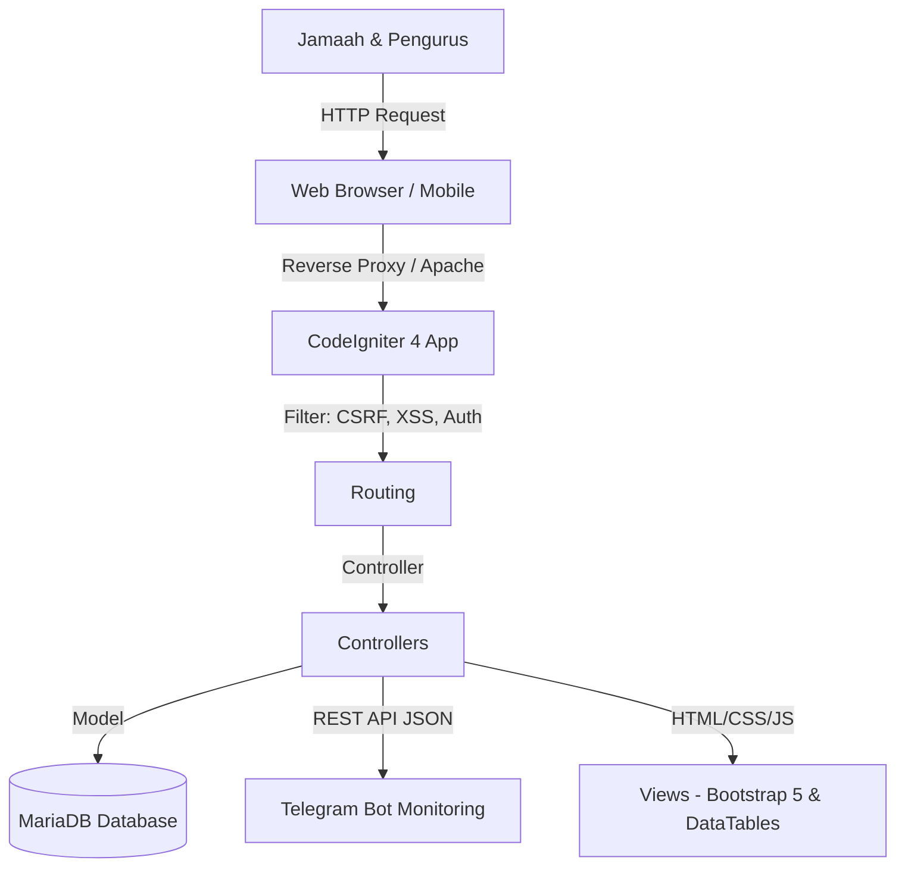

# Rancangan Arsitektur & Database Website Masjid Agung Nujumul Ittihad Sinjai
**Tanggal:** 2026-06-19  
**Versi Dokumen:** v1.0.0  
**Status:** Draf  
**Penyusun:** Alexa (AI Assistant)

---

## 1. Pendahuluan
Dokumen ini menyajikan rancangan arsitektur sistem, struktur database, serta spesifikasi keamanan untuk pembangunan Website Resmi Masjid Agung Nujumul Ittihad Sinjai. Pengembangan sistem ini mengacu pada **Rancangan Website Masjid.pdf** dan diimplementasikan menggunakan **CodeIgniter 4** dengan mematuhi Standar Pengembangan Aplikasi v2.5.

---

## 2. Arsitektur Sistem
Aplikasi dirancang dengan pendekatan MVC (Model-View-Controller) bawaan CodeIgniter 4 dengan integrasi beberapa modul utama untuk menunjang performa dan portabilitas:



### Komponen Utama:
1. **Frontend**: Bootstrap 5, DataTables (Server-Side untuk data besar), Summernote (WYSIWYG Editor), Font Awesome.
2. **Backend**: PHP 8.x, CodeIgniter 4 Framework.
3. **Database**: MariaDB / MySQL dengan optimasi indeks pada foreign key dan kolom pencarian.
4. **Third Party & Helpers**:
   - Integrasi API Jadwal Sholat otomatis.
   - Modul Infak Digital (QRIS).
   - `telegram_helper.php` untuk log error kritis dan notifikasi pengurus.
   - Library GD untuk optimasi konversi gambar otomatis ke format **WebP**.

---

## 3. Spesifikasi Keamanan & Autentikasi (Security & Auth Standards)
- **Multi-Method Authentication (Google Auth & Native)**: 
  - Mendukung login native menggunakan username/password (dienkripsi dengan `BCRYPT`).
  - Mendukung integrasi **Google OAuth 2.0** (Google Sign-In) untuk kemudahan akses pengurus. Data dikaitkan melalui email unik dan `google_id`.
- **CSRF & XSS Filtering**: Wajib diaktifkan secara global pada `app/Config/Filters.php`.
- **Autentikasi & RBAC**: Akses kontrol menggunakan modul *Role-Based Access Control* (RBAC) terpusat.
- **Password Hashing**: Menggunakan `password_hash()` dengan algoritma `BCRYPT`.
- **Database Security**: Penggunaan UUID / Hashids untuk primary key yang diekspos pada URL guna mencegah teknik *Insecure Direct Object Reference* (IDOR).
- **Soft Deletes**: Semua tabel transaksi dan master menggunakan kolom `deleted_at` bertipe `datetime`.

---

## 4. Skema Database (Prefix-Based v2.5)

Semua tabel yang dibuat wajib mengikuti ketentuan penamaan prefix:
- `sys_` : Tabel sistem/konfigurasi
- `mst_` : Tabel master/referensi
- `trn_` : Tabel transaksi/operasional
- `log_` : Tabel audit trail & log

### A. Tabel Sistem (`sys_`)

#### 1. Tabel `sys_users`
Menyimpan data pengguna (pengurus masjid, admin, super admin).
```sql
CREATE TABLE `sys_users` (
  `id` CHAR(36) NOT NULL,
  `username` VARCHAR(50) NOT NULL,
  `password` VARCHAR(255) DEFAULT NULL, -- Nullable jika login menggunakan Google Auth
  `email` VARCHAR(100) NOT NULL,
  `google_id` VARCHAR(255) DEFAULT NULL, -- ID unik dari Google OAuth
  `avatar` VARCHAR(255) DEFAULT NULL, -- Link foto profil dari Google OAuth
  `role_id` INT(11) NOT NULL,
  `status` ENUM('active', 'inactive') DEFAULT 'active',
  `created_at` DATETIME DEFAULT CURRENT_TIMESTAMP,
  `updated_at` DATETIME DEFAULT NULL ON UPDATE CURRENT_TIMESTAMP,
  `deleted_at` DATETIME DEFAULT NULL,
  PRIMARY KEY (`id`),
  UNIQUE KEY `idx_sys_users_username` (`username`),
  UNIQUE KEY `idx_sys_users_email` (`email`),
  KEY `idx_sys_users_role` (`role_id`),
  KEY `idx_sys_users_google` (`google_id`)
) ENGINE=InnoDB DEFAULT CHARSET=utf8mb4;
```

#### 2. Tabel `sys_roles`
Menyimpan peran pengguna (Super Admin, Admin Keuangan, Admin TPA, Admin Layanan).
```sql
CREATE TABLE `sys_roles` (
  `id` INT(11) AUTO_INCREMENT NOT NULL,
  `name` VARCHAR(50) NOT NULL,
  `description` TEXT DEFAULT NULL,
  PRIMARY KEY (`id`)
) ENGINE=InnoDB DEFAULT CHARSET=utf8mb4;
```

#### 3. Tabel `sys_settings`
Konfigurasi website terpusat (Nama masjid, alamat, nomor kontak, link media sosial, api key jadwal sholat).
```sql
CREATE TABLE `sys_settings` (
  `key` VARCHAR(50) NOT NULL,
  `value` TEXT NOT NULL,
  `description` VARCHAR(255) DEFAULT NULL,
  PRIMARY KEY (`key`)
) ENGINE=InnoDB DEFAULT CHARSET=utf8mb4;
```

---

### B. Tabel Master (`mst_`)

#### 1. Tabel `mst_imam_khatib`
Data profil imam, khatib, dan muadzin.
```sql
CREATE TABLE `mst_imam_khatib` (
  `id` CHAR(36) NOT NULL,
  `nama` VARCHAR(150) NOT NULL,
  `jabatan` ENUM('imam', 'khatib', 'muadzin', 'imam_khatib') NOT NULL,
  `bio` TEXT DEFAULT NULL,
  `foto` VARCHAR(255) DEFAULT NULL, -- Otomatis WebP
  `no_hp` VARCHAR(20) DEFAULT NULL,
  `created_at` DATETIME DEFAULT CURRENT_TIMESTAMP,
  `updated_at` DATETIME DEFAULT NULL,
  `deleted_at` DATETIME DEFAULT NULL,
  PRIMARY KEY (`id`)
) ENGINE=InnoDB DEFAULT CHARSET=utf8mb4;
```

#### 2. Tabel `mst_agenda`
Data agenda kegiatan masjid (kajian rutin, rapat pengurus, peringatan hari besar).
```sql
CREATE TABLE `mst_agenda` (
  `id` CHAR(36) NOT NULL,
  `judul` VARCHAR(255) NOT NULL,
  `deskripsi` TEXT NOT NULL,
  `tanggal` DATE NOT NULL,
  `waktu` TIME NOT NULL,
  `lokasi` VARCHAR(255) DEFAULT 'Masjid Agung Nujumul Ittihad Sinjai',
  `narasumber` VARCHAR(150) DEFAULT NULL,
  `banner` VARCHAR(255) DEFAULT NULL, -- Otomatis WebP
  `created_at` DATETIME DEFAULT CURRENT_TIMESTAMP,
  `updated_at` DATETIME DEFAULT NULL,
  `deleted_at` DATETIME DEFAULT NULL,
  PRIMARY KEY (`id`),
  KEY `idx_mst_agenda_tanggal` (`tanggal`)
) ENGINE=InnoDB DEFAULT CHARSET=utf8mb4;
```

#### 3. Tabel `mst_berita`
Artikel dakwah dan berita terkini seputar Masjid Agung Nujumul Ittihad Sinjai.
```sql
CREATE TABLE `mst_berita` (
  `id` CHAR(36) NOT NULL,
  `judul` VARCHAR(255) NOT NULL,
  `slug` VARCHAR(255) NOT NULL,
  `konten` LONGTEXT NOT NULL,
  `banner` VARCHAR(255) DEFAULT NULL, -- Otomatis WebP
  `status` ENUM('draft', 'published') DEFAULT 'draft',
  `created_by` CHAR(36) NOT NULL,
  `created_at` DATETIME DEFAULT CURRENT_TIMESTAMP,
  `updated_at` DATETIME DEFAULT NULL,
  `deleted_at` DATETIME DEFAULT NULL,
  PRIMARY KEY (`id`),
  UNIQUE KEY `idx_mst_berita_slug` (`slug`),
  KEY `idx_mst_berita_status` (`status`)
) ENGINE=InnoDB DEFAULT CHARSET=utf8mb4;
```

---

### C. Tabel Transaksi (`trn_`)

#### 1. Tabel `trn_zis`
Pencatatan transaksi Zakat, Infaq, Shadaqah (ZIS) digital.
```sql
CREATE TABLE `trn_zis` (
  `id` CHAR(36) NOT NULL,
  `nama_donatur` VARCHAR(150) DEFAULT 'Hamba Allah',
  `nominal` DECIMAL(15,2) NOT NULL,
  `jenis` ENUM('zakat_fitrah', 'zakat_maal', 'infaq', 'sedekah', 'wakaf') NOT NULL,
  `metode_pembayaran` ENUM('qris', 'transfer_bank', 'tunai') NOT NULL,
  `bukti_transfer` VARCHAR(255) DEFAULT NULL,
  `status_verifikasi` ENUM('pending', 'verified', 'rejected') DEFAULT 'pending',
  `keterangan` TEXT DEFAULT NULL,
  `created_at` DATETIME DEFAULT CURRENT_TIMESTAMP,
  `updated_at` DATETIME DEFAULT NULL,
  `deleted_at` DATETIME DEFAULT NULL,
  PRIMARY KEY (`id`),
  KEY `idx_trn_zis_status` (`status_verifikasi`),
  KEY `idx_trn_zis_jenis` (`jenis`)
) ENGINE=InnoDB DEFAULT CHARSET=utf8mb4;
```

#### 2. Tabel `trn_pendaftaran_tpa`
Penerimaan santri baru secara online untuk Taman Pendidikan Al-Qur'an (TPA) Masjid Agung Nujumul Ittihad Sinjai.
```sql
CREATE TABLE `trn_pendaftaran_tpa` (
  `id` CHAR(36) NOT NULL,
  `nama_santri` VARCHAR(150) NOT NULL,
  `tempat_lahir` VARCHAR(100) NOT NULL,
  `tanggal_lahir` DATE NOT NULL,
  `nama_wali` VARCHAR(150) NOT NULL,
  `no_hp_wali` VARCHAR(20) NOT NULL,
  `alamat` TEXT NOT NULL,
  `status_pendaftaran` ENUM('pending', 'diterima', 'ditolak') DEFAULT 'pending',
  `created_at` DATETIME DEFAULT CURRENT_TIMESTAMP,
  `updated_at` DATETIME DEFAULT NULL,
  `deleted_at` DATETIME DEFAULT NULL,
  PRIMARY KEY (`id`),
  KEY `idx_trn_tpa_status` (`status_pendaftaran`)
) ENGINE=InnoDB DEFAULT CHARSET=utf8mb4;
```

#### 3. Tabel `trn_pengajuan_acara`
Form pengajuan penggunaan ruang/fasilitas masjid untuk acara (pernikahan, kajian komunitas, rapat ormas Islam).
```sql
CREATE TABLE `trn_pengajuan_acara` (
  `id` CHAR(36) NOT NULL,
  `nama_pemohon` VARCHAR(150) NOT NULL,
  `instansi` VARCHAR(150) DEFAULT NULL,
  `nama_acara` VARCHAR(255) NOT NULL,
  `tanggal_acara` DATE NOT NULL,
  `waktu_mulai` TIME NOT NULL,
  `waktu_selesai` TIME NOT NULL,
  `no_hp` VARCHAR(20) NOT NULL,
  `surat_permohonan` VARCHAR(255) DEFAULT NULL, -- PDF terkompresi
  `status_persetujuan` ENUM('pending', 'disetujui', 'ditolak') DEFAULT 'pending',
  `catatan_admin` TEXT DEFAULT NULL,
  `created_at` DATETIME DEFAULT CURRENT_TIMESTAMP,
  `updated_at` DATETIME DEFAULT NULL,
  `deleted_at` DATETIME DEFAULT NULL,
  PRIMARY KEY (`id`),
  KEY `idx_trn_acara_tanggal` (`tanggal_acara`),
  KEY `idx_trn_acara_status` (`status_persetujuan`)
) ENGINE=InnoDB DEFAULT CHARSET=utf8mb4;
```

#### 4. Tabel `trn_keuangan`
Laporan Keuangan Bulanan Transparan (Kas Masuk & Kas Keluar).
```sql
CREATE TABLE `trn_keuangan` (
  `id` CHAR(36) NOT NULL,
  `tanggal` DATE NOT NULL,
  `kategori` ENUM('operasional', 'pembangunan', 'zis', 'sosial') NOT NULL,
  `tipe` ENUM('masuk', 'keluar') NOT NULL,
  `nominal` DECIMAL(15,2) NOT NULL,
  `keterangan` VARCHAR(255) NOT NULL,
  `penanggung_jawab` VARCHAR(100) DEFAULT NULL,
  `created_at` DATETIME DEFAULT CURRENT_TIMESTAMP,
  `updated_at` DATETIME DEFAULT NULL,
  `deleted_at` DATETIME DEFAULT NULL,
  PRIMARY KEY (`id`),
  KEY `idx_trn_keuangan_tanggal` (`tanggal`),
  KEY `idx_trn_keuangan_tipe` (`tipe`)
) ENGINE=InnoDB DEFAULT CHARSET=utf8mb4;
```

#### 5. Tabel `trn_jadwal_jumat`
Pencatatan jadwal petugas salat Jumat mingguan (Khatib, Imam, Muadzin, dan Judul Khotbah).
```sql
CREATE TABLE `trn_jadwal_jumat` (
  `id` CHAR(36) NOT NULL,
  `tanggal` DATE NOT NULL,
  `khatib_id` CHAR(36) NOT NULL,
  `imam_id` CHAR(36) NOT NULL,
  `muadzin_id` CHAR(36) NOT NULL,
  `judul_khotbah` VARCHAR(255) DEFAULT NULL,
  `keterangan` TEXT DEFAULT NULL,
  `created_at` DATETIME DEFAULT CURRENT_TIMESTAMP,
  `updated_at` DATETIME DEFAULT NULL,
  `deleted_at` DATETIME DEFAULT NULL,
  PRIMARY KEY (`id`),
  KEY `idx_trn_jumat_tanggal` (`tanggal`),
  KEY `idx_trn_jumat_khatib` (`khatib_id`),
  KEY `idx_trn_jumat_imam` (`imam_id`),
  KEY `idx_trn_jumat_muadzin` (`muadzin_id`)
) ENGINE=InnoDB DEFAULT CHARSET=utf8mb4;
```
```

---

### D. Tabel Log / Audit Trail (`log_`)

#### 1. Tabel `log_activities`
Mencatat jejak perubahan data (Before vs After) menggunakan mekanisme `log_activity()`.
```sql
CREATE TABLE `log_activities` (
  `id` BIGINT(20) AUTO_INCREMENT NOT NULL,
  `user_id` CHAR(36) DEFAULT NULL,
  `action` VARCHAR(50) NOT NULL, -- INSERT, UPDATE, DELETE
  `table_name` VARCHAR(50) NOT NULL,
  `record_id` CHAR(36) NOT NULL,
  `before_data` LONGTEXT DEFAULT NULL, -- JSON format data sebelum perubahan
  `after_data` LONGTEXT DEFAULT NULL,  -- JSON format data setelah perubahan
  `ip_address` VARCHAR(45) DEFAULT NULL,
  `user_agent` VARCHAR(255) DEFAULT NULL,
  `created_at` DATETIME DEFAULT CURRENT_TIMESTAMP,
  PRIMARY KEY (`id`),
  KEY `idx_log_activities_user` (`user_id`),
  KEY `idx_log_activities_created` (`created_at`)
) ENGINE=InnoDB DEFAULT CHARSET=utf8mb4;
```

#### 2. Tabel `log_telegram`
Pencatatan aktivitas request dan response integrasi bot Telegram.
```sql
CREATE TABLE `log_telegram` (
  `id` BIGINT(20) AUTO_INCREMENT NOT NULL,
  `bot_action` VARCHAR(100) NOT NULL,
  `request_data` TEXT DEFAULT NULL,
  `response_data` TEXT DEFAULT NULL,
  `status` ENUM('success', 'failed') NOT NULL,
  `created_at` DATETIME DEFAULT CURRENT_TIMESTAMP,
  PRIMARY KEY (`id`)
) ENGINE=InnoDB DEFAULT CHARSET=utf8mb4;
```

---

## 5. Standard API Response
Semua REST API yang dikembangkan wajib mengembalikan response JSON seragam:
```json
{
  "status": true,
  "message": "Data berhasil dimuat.",
  "data": []
}
```
Untuk error atau validasi gagal:
```json
{
  "status": false,
  "message": "Validasi gagal.",
  "data": {
    "username": "Username sudah terdaftar."
  }
}
```
