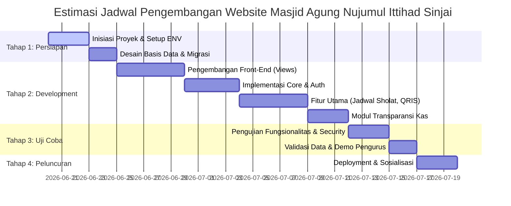

# Roadmap Pengembangan Website Masjid Agung Nujumul Ittihad Sinjai
**Tanggal:** 2026-06-19  
**Versi Dokumen:** v1.0.0  
**Status:** Draf  
**Penyusun:** Alexa (AI Assistant)

---

## 1. Pendahuluan
Dokumen ini menetapkan peta jalan (roadmap) dan tahapan pengembangan Website Resmi Masjid Agung Nujumul Ittihad Sinjai. Rencana ini disusun berdasarkan analisis kebutuhan fungsional (MVP) dan non-fungsional dengan memadukan Standar Pengembangan v2.5 untuk memastikan sistem yang aman, andal, dan modular.

---

## 2. Pembagian Rilis & Skala Fitur (MVP vs Fase Lanjutan)

### Fase 1: Minimum Viable Product (MVP) - Prioritas Utama
Fase ini berfokus pada fitur inti yang krusial untuk peluncuran pertama:
1. **Sistem Jadwal Sholat**: Integrasi API jadwal sholat otomatis dengan fallback local cache.
2. **Modul Infak Digital**: Integrasi QRIS dan informasi rekening bank resmi.
3. **Pusat Notifikasi / Pengumuman**: Banner atau teks berjalan (running text) untuk pengumuman mendesak di halaman utama.
4. **Profil Masjid Mandiri**: Halaman statis/dinamis untuk sejarah, visi & misi, dan struktur kepengurusan.
5. **Panel Admin (RBAC Dasar)**: Autentikasi dasar untuk mengelola konten berita dan kas keuangan.
6. **Laporan Keuangan Transparan**: Modul pencatatan kas masuk & kas keluar bulanan.

### Fase 2: Fase Lanjutan (Pelayanan Digital)
Fase ini dikembangkan setelah Fase 1 stabil dan dirilis ke publik:
1. **Pendaftaran TPA Online**: Form pendaftaran santri baru dan dashboard admin pengelola pendaftaran.
2. **Pendaftaran ZIS Online**: Form pelaporan dan verifikasi pembayaran zakat (fitrah/maal) serta sedekah.
3. **Pemberitahuan Telegram**: Integrasi notifikasi bot Telegram untuk perubahan keuangan besar dan laporan error sistem.
4. **Form Pengajuan Acara**: Layanan pemesanan pemakaian aula/masjid untuk acara masyarakat.
5. **Summernote Editor & DataTables Server-Side**: Optimasi penuh panel admin untuk data berskala besar.

---

## 3. Detail Tahapan Pengembangan

### 3.1 Tahap 1: Persiapan (Preparation)
- **Aktivitas**:
  - Inisialisasi repositori Git dan setup framework **CodeIgniter 4**.
  - Konfigurasi file `.env` untuk masing-masing lingkungan kerja.
  - Setup database dan eksekusi skema database (tabel `sys_`, `mst_`, `trn_`, dan `log_`).
  - Pengumpulan aset awal (logo masjid, teks profil, foto kepengurusan).

### 3.2 Tahap 2: Development (Pengerjaan Sistem)
- **Aktivitas**:
  - Implementasi base template responsif (Mobile Friendly) menggunakan Bootstrap 5.
  - Pembuatan modul autentikasi terenkripsi (`BCRYPT`) dan manajemen session yang aman (CSRF & XSS active).
  - Integrasi API jadwal sholat otomatis.
  - Pembuatan modul visual QRIS Infak Digital.
  - Pembangunan dashboard admin untuk Laporan Keuangan Bulanan dan Pengumuman Masjid.
  - Implementasi audit trail (`log_activities()`) untuk mencatat aksi pengurus.

### 3.3 Tahap 3: Uji Coba (Testing & Validasi)
- **Aktivitas**:
  - Pengujian responsivitas UI pada perangkat Mobile, Tablet, dan Desktop.
  - Pengujian keamanan (input sanitization, CSRF token verification).
  - Validasi data keuangan bersama bendahara Masjid Agung Nujumul Ittihad Sinjai.
  - Simulasi pengisian form pengajuan acara dan pendaftaran TPA.

### 3.4 Tahap 4: Peluncuran (Deployment & Launching)
- **Aktivitas**:
  - Konfigurasi Virtual Host dan rilis web pada hosting/VPS (disarankan domain `.or.id` atau `.id`).
  - Konfigurasi backup database otomatis.
  - Sosialisasi penggunaan panel admin kepada pengurus masjid.
  - Publikasi website kepada jamaah.

---

## 4. Protokol Pengembangan & Git Commit Standard
Setiap pengembang yang berkontribusi pada proyek ini wajib mengikuti aturan teknis berikut:

1. **Linting Wajib**: Sebelum melakukan commit atau push, jalankan perintah `php -l` pada semua file PHP yang dimodifikasi.
2. **Git Commit Format**: Menggunakan format `YYMMDD - [Tipe]: Deskripsi`.
   * Contoh: `260620 - [Added]: Integrasi API Jadwal Sholat Kemenag`
3. **Dokumentasi Rilis**: Setiap perubahan signifikan wajib didokumentasikan di `RELEASE_NOTES.md` pada root project.
4. **Git Push Protocol**: Gunakan script `push.sh` untuk melakukan push otomatis dengan deteksi branch dan standard commit message.
